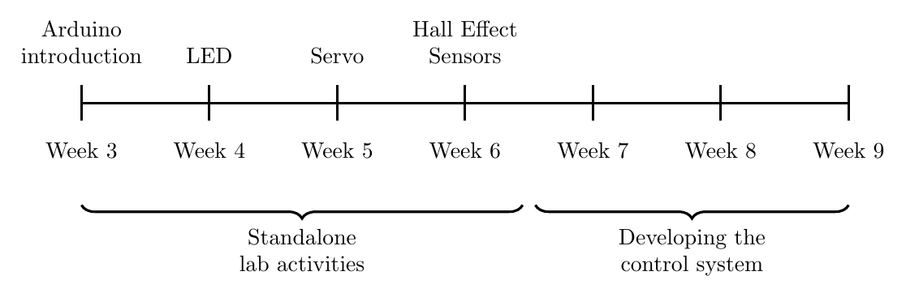

# MAC 233 — Arduino Labs

This repository contains all the documentation, code and information you will need for the MAC 233 Arduino programming course.

## Timeline

The Arduino labs run over seven weeks, in two halves: four standalone lab activities, then three weeks building a control system for your mini rig.

Each lab builds on the one before it, so work through them in order.

## Getting started

You will need the [Arduino IDE](https://www.arduino.cc/en/software) and an **Arduino Nano Every**.

In the IDE, go to `Tools` → `Board` → `Select Other Board and Port`, search for `nano every`, and select both the board **and** the port — selecting only the board will let you compile, but not upload.

Keep the [Nano Every pinout diagram](https://docs.arduino.cc/resources/pinouts/ABX00028-full-pinout.pdf) to hand: every lab refers to it when telling you which pin to wire something to.

If you have not used the Arduino IDE before, Lab 1 walks through all of this step by step, so start there!

## Labs

During weeks 3-6 we will complete standalone lab activities. All the required information can be found below. If you finish a lab early, feel free to move onto the next one.

| Week | Lab | Sketch | Worksheet | Slides |
|---|---|---|---|---|
| 3 | Introduction to Arduino / Blink | [ino](labs/lab-1-blink/lab-1-blink.ino) | [pdf](labs/lab-1-blink/docs/lab-1-blink.pdf) | [pdf](labs/lab-1-blink/slides/slides.pdf) |
| 4 | External LED | [ino](labs/lab-2-led/lab-2-led.ino) | [pdf](labs/lab-2-led/docs/lab-2-led.pdf) | [pdf](labs/lab-2-led/slides/slides.pdf) |
| 5 | Servo | [ino](labs/lab-3-servo/lab-3-servo.ino) | [pdf](labs/lab-3-servo/docs/lab-3-servo.pdf) | [pdf](labs/lab-3-servo/slides/slides.pdf) |
| 6 | Hall effect sensors | [ino](labs/lab-4-hall-effect-sensor/lab-4-hall-effect-sensor.ino) | [pdf](labs/lab-4-hall-effect-sensor/docs/lab-4-hall-effect-sensor.pdf) | [pdf](labs/lab-4-hall-effect-sensor/slides/slides.pdf) |

## Control system

During weeks 7-9, you will build a control system for your mini rig e-bike, adding one part at a time and testing each part before adding the next. One worksheet and one sketch cover all three weeks, in three phases:

- **Phase 0: how the control system works.** Read through the sketch, which is given to you complete, and check your understanding.
- **Phase 1: building and verifying the electronics.** Build the circuit in five steps (sensors, LEDs, servo needle and motor driver), testing each one before moving on.
- **Phase 2: developing the control system.** Test the example controller on your rig, see where it falls short, and start improving it.

You don't need your mini rig to get started: build steps 1-4 only need your Arduino kit and a magnet, and you will move the system onto your rig once it is ready. Below is a rough guide as to how you might spend the three weeks, but feel free to progress at your own pace.

| Week | Phase | Sketch | Worksheet | Slides |
|---|---|---|---|---|
| 7 | Phase 0, then Phase 1 steps 1-3 | [ino](control-system/control-system.ino) | [pdf](control-system/docs/control-system.pdf) | [pdf](control-system/slides/phases-0-1.pdf) |
| 8 | Phase 1 steps 4-5 | [ino](control-system/control-system.ino) | [pdf](control-system/docs/control-system.pdf) | |
| 9 | Phase 2 | [ino](control-system/control-system.ino) | [pdf](control-system/docs/control-system.pdf) | [pdf](control-system/slides/phase-2.pdf) |

## Licence and attribution

This material was originally written by Dr Dan Brennan ([github.com/dsbrennan](https://github.com/dsbrennan)) and is now maintained by Dr Max Champneys (max.champneys@sheffield.ac.uk).

Released under the MIT Licence: see [LICENSE](LICENSE).

The licence does not cover the following third-party material, which remains under its owners' terms:

- The University of Sheffield logos in `theme/theme-assets/`.
- Arduino's Nano Every pinout diagram, board images and IDE screenshots, from [arduino.cc](https://www.arduino.cc/).
- The breadboard and resistor images, adapted from public domain images on [freesvg.org](https://freesvg.org/).

